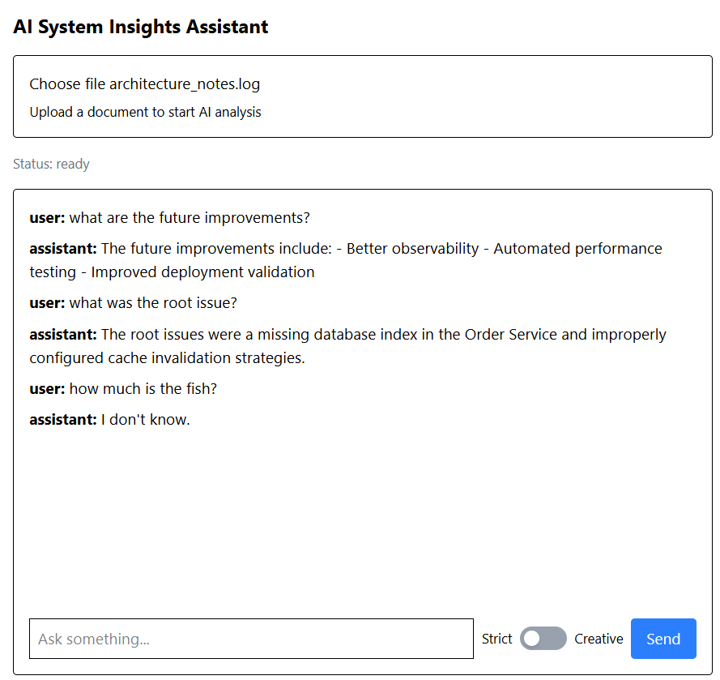

# AI System Insights Assistant

An AI-powered document analysis tool that uses Retrieval-Augmented Generation (RAG) to help engineers understand system logs and technical documents.

---

## 🚀 Overview

Debugging system issues from logs and documentation is time-consuming and often requires deep domain knowledge.

This project allows users to:

* Upload system logs or documents
* Ask questions in natural language
* Receive context-aware, AI-generated answers grounded in their data

It combines semantic search (embeddings) with large language models to provide accurate and insightful responses.

---

## 🧠 Key Features

### 🔍 Retrieval-Augmented Generation (RAG)

* Semantic search using embeddings
* Context injection into LLM prompts
* Grounded responses based on uploaded data

### ⚖️ Dual-Mode Reasoning

* **Strict mode**: factual, context-only answers
* **Creative mode**: enriched answers with reasoning and insights

### ⚡ Flexible Vector Storage

Supports two interchangeable storage backends:

* **Local JSON store (MVP)**

  * Simple, transparent, no setup
  * Ideal for development and learning

* **ChromaDB (Production-ready)**

  * Efficient vector indexing
  * Scalable similarity search
  * No need for manual file handling

---

### ⚡ Efficient Ingestion Pipeline

* Document chunking
* Embedding generation
* Storage in selected vector backend
* **Hash-based deduplication** to prevent duplicate chunks

### 📂 Metadata Tracking

Each stored chunk includes:

* Unique hash ID
* Source file name

Enables:

* traceability
* document-level operations
* future filtering

---

### 💬 Interactive Chat UI

* Chat-based interface
* Mode toggle (Strict ↔ Creative)
* Error handling with toast notifications
* Loading states for better UX

---

## 🏗️ Architecture

### Ingestion Pipeline (Offline)

Document → Chunking → Embeddings → Vector Store (JSON / ChromaDB)

### Query Pipeline (RAG)

User Query → Embedding → Similarity Search → Context Injection → LLM → Response

---

## 🧩 Tech Stack

### Frontend

* React + TypeScript
* Tailwind CSS
* react-hot-toast

### Backend

* Node.js + Express
* TypeScript

### AI Components

* Embeddings: Gemini API
* LLM: Gemini (switchable to other providers)
* Vector Store:

  * Local JSON (MVP)
  * ChromaDB (scalable option)

---

## ⚙️ How It Works

### 1. Upload Document

* File is chunked into smaller pieces
* Each chunk is converted into an embedding
* Stored in selected vector backend (JSON or ChromaDB)

### 2. Ask a Question

* Query is embedded using the same model
* Compared against stored embeddings using cosine similarity

### 3. Retrieve Context

* Top-K relevant chunks are selected
* Low-score matches are filtered out

### 4. Generate Answer

* Context is injected into a prompt
* LLM generates a grounded response

---

## 🔄 Vector Store Configuration

You can switch between storage backends depending on your needs.

### Example configuration

```env
VECTOR_STORE=json
# or
VECTOR_STORE=chroma
```

---

### JSON Store

* File-based (`vectorStore.json`)
* Full control and visibility
* Ideal for debugging and small datasets

---

### ChromaDB

* In-process vector database
* Faster similarity search
* Better scalability
* Cleaner abstraction for production use

---

## 🧠 Design Decisions

### Why support both JSON and ChromaDB?

* JSON enables rapid prototyping and transparency
* ChromaDB introduces scalability and real-world architecture
* Demonstrates abstraction of vector storage layer

---

### Why hash-based deduplication?

* Prevents duplicate chunks across uploads
* Constant-time lookup (O(1))
* Deterministic IDs based on content

---

### Why dual-mode RAG?

* Demonstrates control over LLM behavior
* Balances factual accuracy vs reasoning depth

---

### Why hybrid architecture?

* Local retrieval (fast, cost-efficient)
* Remote LLM (powerful reasoning)

---

## 🛠️ Getting Started

### 1. Clone the repository

```bash
git clone <your-repo-url>
cd ai-system-insights-analyzer
```

---

### 2. Install dependencies

```bash
# backend
cd backend
npm install

# frontend
cd ../frontend
npm install
```

---

### 3. Configure environment

Create `.env` in backend:

```env
GEMINI_API_KEY=your_api_key_here
VECTOR_STORE=json
```

---

### 4. Run the app

```bash
# backend
cd backend
npm run dev

# frontend
cd frontend
npm run dev
```

---

### 5. Open in browser

http://localhost:5173

---

## 🧪 Example Use Cases

* Debugging system latency issues
* Analyzing backend logs
* Understanding large technical documents
* Internal knowledge base querying

---

## 🔮 Future Improvements

* Streaming responses (real-time typing)
* Document management (delete / re-index)
* Multi-document filtering
* Prompt injection protection
* Cloud vector DB support (Pinecone, Weaviate)

---

## 🎯 What This Project Demonstrates

* End-to-end RAG system design
* Embeddings and semantic retrieval
* Vector store abstraction (JSON ↔ ChromaDB)
* Prompt engineering and LLM control
* Backend + frontend integration
* Practical AI product thinking

---

## 📸 Demo


---

## 🧠 Author Notes

This project was built to explore how modern AI systems combine retrieval and generation to produce reliable, context-aware answers.

It focuses not just on functionality, but on **understanding, controlling, and scaling AI systems**.

---

## 📄 License

MIT

---

## Technical guide

### 1. Local vectors vs ChromaDB
To switch local vs chroma use vectorStore.factory.ts file (line const backend = process.env.VECTOR_STORE ?? 'chroma'; // default to json (chroma is optional and requires separate setup))

### 2. ChromaDB
Start with: chroma run --path ./chroma_data
Debug with: http://localhost:4000/debug/chroma